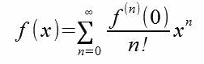

# Taylor_Series, AP Comp Sci
A program that creates taylor series approximations of functions
(possible graphing functionality)

(5/9) In order to program a taylor series I first need to find 
the functions that I'll be working on. To start off, I'll deal with polynomials.
First I need to find the limit, and after that I can apply the definition of a derivative 
in order to find different degree taylor polynomials and approximations.

(5/19) Did some more modification on the limit object, here is a reference of 
a taylor series at ), i.e. Maclaurin approximation. 

